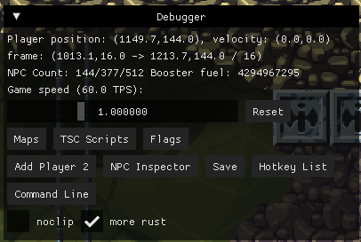
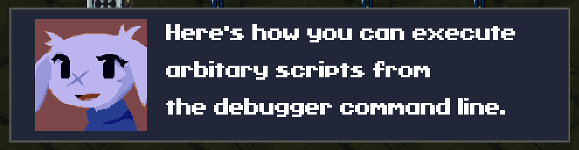

# Debugging and testing

## Built-in utils


Hereinafter in this section, **the player** will refer to **Player 1** unless otherwise stated.


### Debugger

If doukutsu-rs is built in debug mode, or if the `debug_mode` parameter is set to `true` in the settings file (`settings.json`), you can open the debug menu with the `F12` key. This menu can only be opened during game play, it cannot be opened from the main screen or during game loading. This menu cannot be used in full screen mode and can be opened only if the engine is built with SDL backend (feature `backend-sdl`).

<div data-full-width="false"><figure><figcaption></figcaption></figure></div>


Coordinates are displayed in `(x, y)` format, where `x` and `y` are represented in pixels and are floating point numbers (`f32`/`float`).


The debug menu contains the following information:

* coordinates of the player
* player movement speed
* coordinates of the upper left corner and target (center) of the frame (camera), and camera movement speed in ticks (set via the `<FON`, `<FOM` and `<FOB` opcodes)
* the number of alive NPCs on the map, the number of the last occupied slot in the NPC list, and the maximum possible number of occupied slots (512 by default)
* booster fuel
* game speed (ticks per second)
* game speed multiplier (from 0.1 to 3)
* additional submenus
  * **Maps** - list of loaded stages
  * **TSC Scripts** - text script execution state, list of loaded text scripts, as well as their representation in the form of pseudocode
  * **Flags**
  * **NPC Inspector** — list of NPCs on the map and their properties
  * **Save**
  * **Hotkey list**
  * **Command line** — opens the debug command line

You can also use hotkeys to toggle some settings that are missing in the debug menu:

* `Ctrl + S` — quick save
* `ESC + F2` — quick reset (quick load)
* `F3` — toggle godmode (invulnerability)
* `F4` — toggle [infinite booster fuel](#user-content-fn-1)[^1]
* `F5` — toggle subpixel scrolling
* `F6` — toggle motion interpolation
* `F7` — reset game speed multiplier
* `F8` — decrease game speed multiplier for 0.1
* `F9` — increase game speed multiplier for 0.1
* `F10` — toggle debug overlay (display the slot for each NPC, its type/npc\_id and `action_num)`
* `F11` — toggle FPS counter. The counter will display FPS on the first line and TPS[^2] on the second line
* `` ` `` — toggle command line
* `Ctrl + F3` — reload sound manager. Due to the specifics of the sound manager implementation, the music will completely stop until you enter some new location or room, which would start a new song in the background

### Command line

The command line supports both a set of inbuilt commands and arbitrary execution of TSC opcodes.


All numeric parameters of commands have a 16-bit unsigned integer data type (`u16`/`uint16_t`/`unsigned short`), unless otherwise specified. Consequently, the limit of their accepted values is 0 to 16535.


List of inbuilt commands (in `/command param` format):

* `/add_item item_id`, `/remove_item item_id` - adds/removes item from inventory.
* `/add_weapon weapon_id ammo_count`, `/remove_weapon weapon_id` - adds/removes weapon from inventory.
* `/add_weapon_ammo ammo_count` - adds the specified number of ammunition to the currently selected weapon.
* `/set_weapon_max_ammo max_ammo_count` - sets the maximum number of ammunition for the currently selected weapon.
* `/refill_ammo` - refills the ammo of the currently selected player weapon.
* `/refill_hp` - refills player's health.
* `/add_xp xp_count`, `/remove_xp xp_count` - adds/removes the specified number of XP to the currently selected player weapon.
* `/set_max_hp hp_count` - set the value of player's max health.
* `/spawn_npc npc_id` - spawn NPC of the specified type in front of the player.
* `/teleport_player x y` - teleport the player to the specified coordinates. Parameters `x` and `y` are floating point numbers (`f32`/`float` data type).
* `/tsc text_script` - executes the specified text scripts. `text_script` - not the name of the script file, but the script itself (e.g. `<FOM0160`).

If you enter a raw TSC script into the command line, it will be executed. For example, if you enter the following script into the command line:


```
<KEY<MSG<FAC0001Here's how you can execute\narbitary scripts from\nthe debugger command line.<NOD<END
```


the result will be:

<figure><figcaption></figcaption></figure>

`\n` is used to wrap a line, because the command line doesn't support multi-line text.

[^1]: It's not really infinite, so it could potentially run out if you use the booster non-stop for about 2 years.

[^2]: Ticks Per Second
