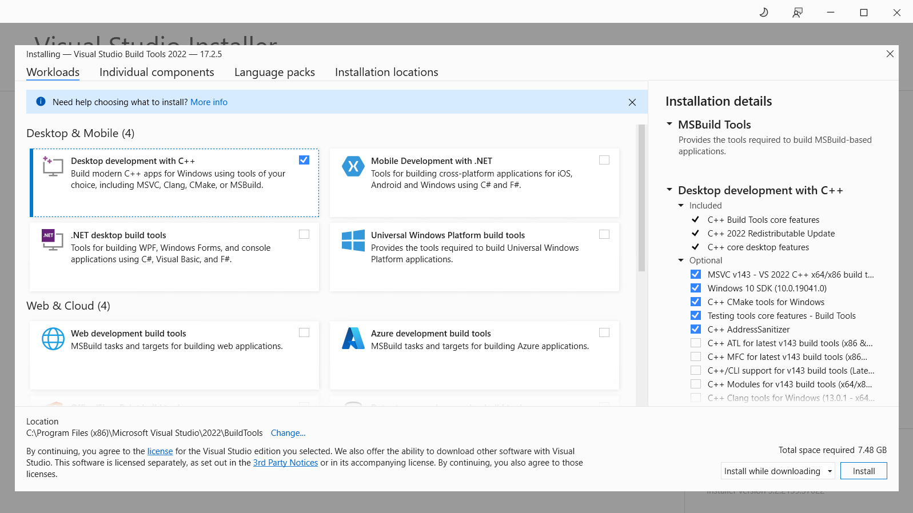

# Building the ports

doukutsu-rs has three official ports: 1 stable and 2 experimental.

Stable ports:

* Android.

Experimental ports:

* Nintendo Switch (also reffered as Horizon);
* XBox/UWP (Universal Windows Platform).

**Stable ports** are part of the upstream codebase, they are actively maintained and have official release builds. They can definetly be compiled and the compilation steps are known and most likely documented.

**Experimental ports**, on the other hand, typically don't have stable release and nightly builds, and their build algorithm may be undocumented or even broken. If you don't see there the build instruction for some port, then it is most likely that the compilation of this port is not possible or the build steps are unknown.

Please note that this guide provides instructions for building ports on PC only. So first install Rust and clone the doukutsu-rs repository, as described in [the previous section](./#id-2.-install-rust).

## Android

### 1. Install Java

The Android port is written in Java, and the build tools require the Java Runtime, so you need to install JDK (Java Development Kit) to build this port. The **minimum** version of Java required to run Android development tools is **Java 17**.

#### Windows

On Windows you can install JDK following [the official installation instructions](https://docs.oracle.com/en/java/javase/21/install/installation-jdk-microsoft-windows-platforms.html#GUID-A7E27B90-A28D-4237-9383-A58B416071CA) provided by Oracle.

#### Linux

On Linux, JDK is usually installing from the repositories of the distribution you are using.

**Arch-based distributions (Arch Linux, Manjaro, EndeavourOS, etc.):**

```
sudo pacman -Sy jdk17-openjdk
```

**Debian-based distributions (Debian, Ubuntu, Linux Mint, Pop!\_OS, etc.):**

```
sudo apt update
sudo apt install openjdk-17-jdk
```

### 2. Install Android Studio

Android Studio is the primary IDE for Android applications development, so in this guide we'll use it.

To install Android Studio, download it from [the Android Developers portal](https://developer.android.com/studio). The minimum version required for building doukutsu-rs is **Flamingo | 2022.2.1**.

***

#### Windows

Download the installer and just install Android Studio. Then run it via a shortcut in the Start Menu or Desktop.

#### Linux

After downloading the archive, extract it to any location you want (in this example we will extract it into `~/.bin`):

```
tar -xvpzf {DOWNLOADED_ARCHIVE_NAME}.tar.gz -C ~/.bin
```

Then open a console (if you hasn't open it yet), enter into the extracted folder, and run `bin/studio.sh`script (give it execute permission, if it isn't set):

```
cd ~/.bin/android-studio/bin
chmod +x studio.sh
./studio.sh
```

***


If Android Studio is started without any errors, you can move to the next step.

### 3. Install Rust targets

The Android builds of doukutsu-rs supports ARMv7, ARMv8, x86 and x86-64 architectures. To build it you need to install the appropriate Rust targets:

```
rustup target add aarch64-linux-android armv7-linux-androideabi i686-linux-android x86_64-linux-android
```

### 4. Install Android development kits

Launch Android Sudio and on the welcome screen, press `"More actions"` and select `"SDK Manager"` from the dropdown menu. In the window that opens, tick `"Show package details"`.

<figure><figcaption><p><code>"Show Package Details"</code> is checked.</p></figcaption></figure>

To understand what version of the development kits you need to install, look at the `app/app/build.gradle` file from the doukutsu-rs directory. In this build config `compileSdkVersion` property stores the API level, that you can use to install the required Platform SDK. `buildToolsVersion` and `ndkVersion` store the exact version of build tools and NDK, required for build. Also install **CMake 3.18+** in the SDK Manager.


Install exactly the development kits version, that are specified in the build config. Otherwise the build can fail.


### 5. Configuring the project

When all dependencies are installed, we can finaly open the project in Android Studio and configure it for building.

Open Android Studio, click `"Open project"` and select the `app` directory from the cloned doukutsu-rs repository.

<figure><figcaption><p>Open this exact folder, not the cloned repository itself or anything else.</p></figcaption></figure>

When you open the project, in the bottom right corner will appear a notification asking you to install Android Gradle Plugin. Install it. If it will suggest to upgrade it, dismiss this notification.

After that, open `build.gralde` file from the `app` module and sync the project.


If after sync or build attempt, you get an error like `"SDK not found"` or `"NDK not found"`, but you are sure that you have installed the correct versions of SDK and NDK, you need to manually specify the paths to them.

Create a `local.properties` file and place the following content in it (replace `{ANDROID SDK installation path}` with the absolute path where you installed the Android SDK and `{NDK version}` with the version of NDK specified in the doukutsu-rs build config):


```properties
sdk.dir={ANDROID SDK installation path}
ndk.dir={ANDROID SDK installation path}/ndk/{NDK version}/
```


For example, if you are working on Windows and have installed SDK in the `C:\Android\Sdk`, this file will look like this:


```properties
sdk.dir=C\:\\Android\\Sdk
ndk.dir=C\:\\Android\\Sdk\\ndk\\25.2.9519653\\
```


Resync the project and try to run the build.


<figure><figcaption><p>Open the build config from the <code>app</code> module and sync the project.</p></figcaption></figure>

### 6. Build

If you lucky enough to not encouter errors or troubles in the previous steps, you can click the hammer on the top panel or press `Ctrl+F9` to build the project. The output APK will be in the `app/app/build/outputs/apk/debug` folder.

By default the debug builds that support only ARMv8 (`arm64`) architecture will be generated. If you want to make a debug build for another architecture, you need to change the targets field in the `cargoNdk.buildTypes.debug` section (it is located at the end of build config).

### 7. (Optional) Signing the build

All builds **require** signing, unsigned builds cannot be installed (you will get an error, if you try to install an unsigned build). Debug builds are automatically signed by Android Studio's built-in keystore, but release builds requires manual configuration. To generate a signed release build, click **"Build"** -> **"Generate Signed Bundle / APK"**. Choose **"APK"** and the keystore for signing, if it exists, or create one if it doesn't.&#x20;


If you create a keystore in the Android Studio, only the password and the issuer's "First and Last Name" fields are mandatory. All other fields can be left blank.


When you complete, Android Studio will automatically run the build with specified signing keystore. The generated build will be placed in `app/app/build/outputs/apk/release`.
