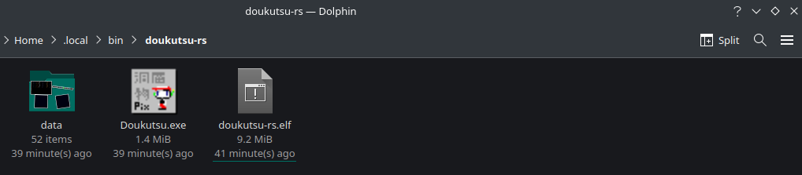
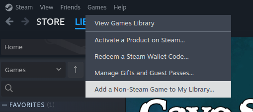
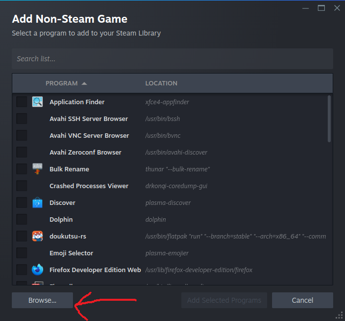
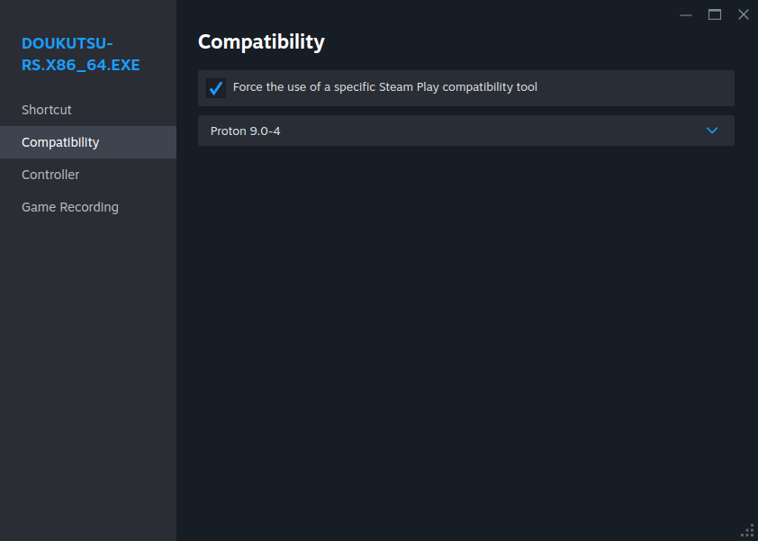

# Linux

Linux gives you choices, and installing doukutsu-rs is no different! Here are a few ways to get it running on your system, pick the one that sounds best for you:

## 1. The Easiest Way: Install with Flatpak

If you're new to Linux or just want the simplest install, **Flatpak** is the way to go. It's like a universal app store for Linux!

* **Super Simple Commands:** Just a single command in your terminal to install everything.
* **Always Up-to-Date:** Flatpak usually gives you the latest version of doukutsu-rs automatically.
* **Safer Apps:** Flatpak keeps apps isolated from the rest of your system, which is good for security.

***

### 1.1. Install Flatpak

You can find detailed instructions on how to install Flatpak for your distribution on the [official website](https://flatpak.org/setup/).

### 1.2. Install doukutsu-rs

Via console you can install doukutsu-rs with the following command:

```
flatpak install -u flathub io.github.doukutsu_rs.doukutsu-rs
```

If the installation is successful, there should usually be created a shortcut on Desktop or Start menu. From the console, you can run doukutsu-rs with the following command:

```
flatpak run io.github.doukutsu_rs.doukutsu-rs
```

If you want to apply your own game data (e.g. Cave Story+ or Switch data), place the `data` folder in the `$XDG_DATA_HOME/doukutsu-rs` directory (that being `$HOME/.var/app/io.github.doukutsu_rs.doukutsu-rs/data/doukutsu-rs` by default).

***

## 2. Native Linux Binary: For a Direct Approach

If you like to keep things lean and mean, and want to run doukutsu-rs directly on your system, grab the **native binary release**.

* **No Extra Layers:** Runs directly, so it can be a bit faster and use fewer resources.
* **Just Download and Run:** Get the file from the official downloads page, make it runnable, and you're good to go!
* **Lightweight and Quick:** Very straightforward setup without installing extra software.

***

### 2.1. Download doukutsu-rs&#x20;

* Go to the doukutsu-rs downloads page: [**https://get.doukutsu.rs**](https://get.doukutsu.rs)
* Choose the version for your processor architecture, if it's available.

### 2.2. Create a Folder for doukutsu-rs.

* Create a new folder on your computer to store all the doukutsu-rs files. This keeps things organized.
* You can create this folder anywhere convenient, such as your Desktop or `$HOME/.local/bin` (also known as `XDG_BIN_HOME`) folder. Name it something recognizable, like "doukutsu-rs" or "doukutsu-rs folder".

### 2.3. Place doukutsu-rs in the Folder

* Locate the downloaded doukutsu-rs program file (e.g., `doukutsu-rs.{version}.elf`). This is the file you downloaded in Step 1. The `{version}` part of the program file name indicates the specific build you downloaded.
  * For example, a typical program file name might look like: `doukutsu-rs_linux_0.101.0-beta7.x86_64.elf`.
  * In this example:
    * `linux` indicates it's for Linux.
    * `0.101.0-beta7` is the version number (and potentially release stage like "beta").
    * `x86_64` indicates it's for 64-bit computers.
* The important thing is to move this entire `.elf` file into the folder you created in the previous step. You can do this by dragging and dropping the file.
* Set the execute permission for the downloaded file.
  * In a file manager, you can set this permission in the file properties.
  * From the console this permission is set with the `chmod +x` command. Example:
    * `chmod +x $HOME/.local/bin/doukutsu-rs/doukutsu-rs.elf`.

### 2.4. Add Game Data

* You will need to add the Cave Story game data files to the same folder. These files are contained within a folder named "**data**". If you have played Cave Story previously, you should already have this folder.
* **For Freeware Cave Story Users:** If you are using the original freeware version of Cave Story, also place the original game executable, "**Doukutsu.exe**", into the doukutsu-rs folder alongside the "data" folder and the `doukutsu-rs.{version}.exe` file.
* This file in original **freeware** version stores some necessary data files, such as credits sequence sprites, background music and map list - it must be present at least during first run - it can be deleted after first successful launch. This is not applicable to **Cave Story+**, as all required data is present in the **"data"** folder.
* Move your "**data**" folder (and "**Doukutsu.exe**" if applicable) into the "doukutsu-rs folder".

<figure><figcaption><p>You should end up with directory structure similar to this.</p></figcaption></figure>

### 2.5. (Optional) Create a "user" Folder for Self-Contained Settings and Saves

* This step is optional, but recommended if you prefer to keep all doukutsu-rs files together in one folder.
* If you **don't** create a "user" folder, doukutsu-rs will automatically store your settings and save files in a standard Linux location: `$HOME/.local/share/doukutsu-rs`. This location is usually hidden.
* To keep everything self-contained within your doukutsu-rs folder, create a new folder inside it named **exactly** `user` (all lowercase).

#### You can always change this later:

* Even if you skip creating the "user" folder now, you can switch to using a portable "user" folder at any time from within the game. Go to **Options -> Advanced... -> Make portable user directory**.

### Updating doukutsu-rs to a Newer Version

* Updating doukutsu-rs is very easy! When a new version is released, simply download the new `.elf` program file from the [downloads page](https://get.doukutsu.rs) (just like you did in Step 1).
* **Important:** Make sure doukutsu-rs is completely closed before updating.
* Once downloaded, drag the new `.elf` file into your "doukutsu-rs folder".
* You can then delete the old `.elf` file in your folder, or just replace it by dragging the new one in and choosing "Replace" if Windows prompts you.
* Ensure that the new file has execute permission set.
* **Your settings and save files are safe!** Updating only replaces the program itself. Your game settings and saved games are stored separately (either in the "user" folder if you created it, or in the default Windows location), so they will not be affected by updating the program file.

**Setup Complete!**

You are now ready to play doukutsu-rs. Run the `doukutsu-rs.{version}.elf` program file located in your "doukutsu-rs folder" to start the game.

***

## 3. Run the Windows Version with Wine or Proton: When Things Get Tricky

Sometimes, things don't _just work_. If you have trouble with the native Linux version, or if you're using a less common type of Linux, **Wine** or **Proton** can be your friend. These tools let you run Windows programs on Linux!

* **Fallback Option:** If the native version isn't cooperating, the Windows version often works smoothly through Wine/Proton.
* **Good Compatibility:** Uses the well-tested Windows system stuff (Win32 ABI), which can sometimes be more reliable across different Linux setups.
* **Might Help with Uncommon Linux:** If your Linux isn't based on `glibc` (which is common) or if there are weird version issues, Wine/Proton can sometimes bypass these problems.


To make the Disord Rich Presense functionality work, additional configuration will be required that is not described in this guide.


***

### 3.1. Download doukutsu-rs and set up game data

Follow steps [2.1](linux.md#id-2.1.-download-doukutsu-rs)-[2.4](linux.md#id-2.4.-add-game-data) to install doukutsu-rs and prepare it for use, but download the executable for Windows instead of Linux.

### 3.2. Running with Wine

#### 3.2.1. Install Wine

#### Debian-based distributions (Debian, Ubuntu, Linux Mint, Pop!\_OS, etc.)

```
sudo apt update
sudo apt install wine ttf-mscorefonts-installer
```

#### Arch-based distributions (Arch Linux, Manjaro, EndeavourOS, etc.)

You need to enable multilib repository before installing Wine. You can do it by uncommenting multilib section in `/etc/pacman.conf`:

```
[multilib]
Include = /etc/pacman.d/mirrorlist
```

Then install `wine` package and some of the optional dependencies (you don't need to install the `lib32-*` packages unless you plan to run 32-bit binary):

<pre><code><strong>sudo pacman -Sy wine
</strong>sudo pacman -S --needed --asdeps libpulse lib32-libpulse alsa-plugins lib32-alsa-plugins alsa-lib \
lib32-alsa-lib libxcomposite lib32-libxcomposite
</code></pre>

#### Red Hat-based distributions (CentOS, Fedora, etc.)

```
sudo dnf upgrade
sudo dnf install wine
```

#### 3.2.2. Run doukutsu-rs

Now you can run doukutsu-rs(in this example the doukutsu-rs binary is placed in `$HOME/.local/bin/doukutsu-rs/` and named `doukutsu-rs.x86_64.exe`):

```
wine $HOME/.local/bin/doukutsu-rs/doukutsu-rs.x86_64.exe
```

When the app is runned successfuly, all your saves and settings will be located in the `$HOME/.wine/drive_c/users/{YOUR USERNAME}/AppData/Local/doukutsu-rs/data/` folder, unless you are [created a "user" folder](linux.md#id-2.5.-optional-create-a-user-folder-for-self-contained-settings-and-saves).

### 3.3. Running with Proton

#### 3.3.1. Install Steam

The easiest way to run games via Proton is to add them to your local Steam library and set them to run in "Compatibility" mode. While Steam has official builds only for Ubuntu LTS, on other distributions you can install it from the distribution's repositories (as in [Arch Linux](https://wiki.archlinux.org/title/Steam#Installation)) or from [Flathub](https://flathub.org/apps/com.valvesoftware.Steam) (which is a safer and more reliable variant).

#### 3.3.2. Add doukutsu-rs to the Steam local library

In the top menu click **"Games"** -> **"Add a Non-Steam Game to My Library"** and in the window that appears, select the doukutsu-rs Windows binary that you downloaded in [Step 1](linux.md#id-3.1.-download-doukutsu-rs-and-set-up-game-data).

<figure><figcaption></figcaption></figure>

<figure><figcaption></figcaption></figure>

<figure><figcaption><p>In this example the doukutsu-rs executable is placed in <code>$HOME/.local/bin/doukutsu-rs</code>.</p></figcaption></figure>

Then open the application properties and set compatible tool to Proton (you can use any version, but the latest stable is recommended).

<figure><figcaption></figcaption></figure>

Configuration is complete! When you click **"Play"**, Steam will automatically download and install the Proton of version you selected in the app properties. Wait for the installation to complete and doukutsu-rs is ready to play.

All user data (saves, settings and logs) will be located in `$HOME/.steam/steam/steamapps/compdata/{APP_ID}/pfx/drive_c/users/steamuser/AppData/Local/doukutsu-rs/data`, where `{APP_ID}` of doukutsu-rs you can find by searching through all folders and checking if the specified doukutsu-rs folder is there (it will be created after the first run).

***

## 4. Go Full DIY: Compile from Source

For the adventurous types who like to tinker and have full control, **compiling from source** is the ultimate Linux experience!

* **Total Customization:** You build the game _exactly_ for your system, tweaking settings as you go.
* **Latest and Greatest:** You can often get the very latest, cutting-edge code directly from the developers.
* **Learn More:** You'll get a much deeper understanding of how doukutsu-rs works under the hood (if you're into that!).

***

Compilation instructions can be found in the [#linux](../modders-handbook/initial-setup-and-compiling/#linux "mention") section of the [initial-setup-and-compiling](../modders-handbook/initial-setup-and-compiling/ "mention") page.

***

**Which Method Should You Choose?**

Each method has its pros and cons, reflecting the flexibility of Linux!

* **For most users, Flatpak is the recommended and easiest option.**
* If you prefer a more direct approach, the **native binary** is great.
* **Wine/Proton** is a solid backup plan if you run into issues.
* **Compiling from source** is for advanced users who want maximum control and are comfortable with a bit more work.

No matter which way you choose, have fun playing doukutsu-rs on Linux!
